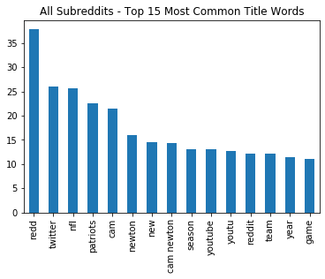
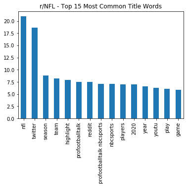
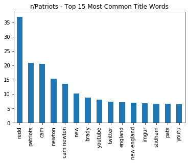
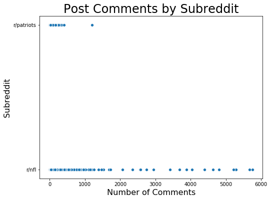
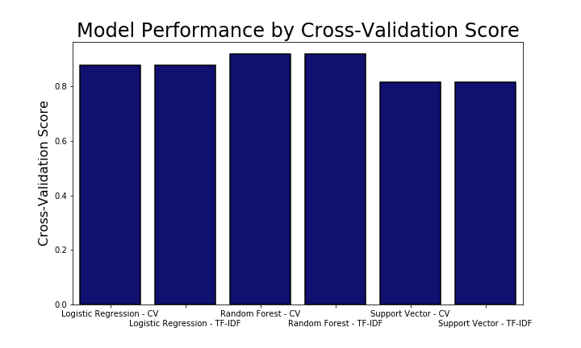
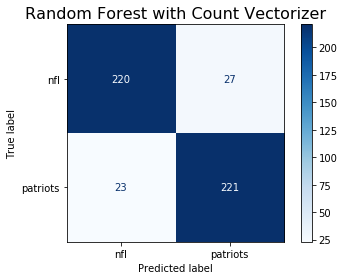

#  Project 3 - Web APIs & NLP

### Problem Statement

The wise and benevolent moderators of Reddit's r/NFL community have gotten tired of their subjects complaining about endless Patriots-related posts. They'd like to shed the r/Patriots2 moniker for good, and they know that the only thing that agitated online mobs respond to is thorough research and hard facts.

As such they'd like to see evidence that the two subreddits are appreciably distinguishable. Ideally, they'd like to see what key characteristics drive the difference between the subreddits.

This establishes two tasks:

1) Create a model that can, as reliably as possible, classify a post as coming from r/NFL or r/Patriots based purely on the content of the post.

2) Ensure that at least one of the high-performing models is sufficiently interpretable to be able to rank the most important distinguishing features.

### Executive Summary

Contents:

* Datasets and Data Cleaning
* Model Files
* Visualization - EDA
* Exploratory Data Analysis
* Model Development
* Visualization - Conclusion
* Conclusions and Recommendations

### Datasets and Data Cleaning

#### Initial Data
- [reddit.com/nfl/new](reddit.com/nfl/new) (collected 2020-07-21]
- [reddit.com/patriots/new](reddit.com/patriots/new) (collected 2020-07-21]

Raw data collected with the Python Reddit API Wrapper ([PRAW](https://praw.readthedocs.io/en/latest/)). The dataset included 1900+ posts, split evenly between the two subreddits.

**Data Dictionary**
[PRAW Submission Data Dictionary](https://praw.readthedocs.io/en/latest/code_overview/models/submission.html)

Note: The self_post column was mistakenly imputed from post content rather than pulled from the API. Its values have not been validated against the proper source.

#### Cleaned Data
- [Base Cleaned Data](./data/subreddits_clean.csv)
- [Count Vectorized Data](./datasets/subreddits_count.csv)
- [TF-IDF Vectorized Data](./datasets/subreddits_tfidf.csv)

Cleaned data includes slight modifications to existing columns:

1) Convert posting datetime to posting hour
2) Convert link URLs to domain names by removing HTTP query string and path
3) Combine title and body into all_text column
4) Vectorize all_text column using count vectorizer and term frequency–inverse document frequency vectorizer

Seperate datasets were output as CSVs with count vectorized data, TF-IDF vectorized data, and a base cleaned dataset without vectorized text data.

### Model Files

####  Files to Run
1) [Data Exploration and Cleaning](./tw_initial_EDA_cleaning)
2) [Modeling](./tw_initial_modeling)

### Visualizations - EDA

### Exploratory Data Analysis

Iniital exploration off the data found significant overlap between the two subreddits, as expected given their shared subject matter. It also illustrated the largest distinctions came from players specifically on the Patriots, as might be expected on a team-oriented subreddit. Significant, and larger than expected, differences emerged in the websites being linked most often between the two subreddits.

Many common news sources appeared significantly less often in r/Patriots, while many Patriots and New England-specific websites showed up with some regularity within r/NFL. The most notable difference in website frequency for r/Patriots was actually the Reddit image hosting site, likely because of restriction in r/NFL on the posting of memes and other similar content.

While significantly different patters could be seen in posting times, the significant overlap would likely make it an overall weak predictor. **Note**: This variable was mistreated in the initial modeling and should have been dummified in order to properly evaluate its predictive power. This could be corrected in subsequent model runs.

### Model Development

The logistic regression models used to help predict the most useful parameters for the different vectorizers proved highly accurate without any tuning, making it a reasonable selection for a first model. As with all models in this project, the logistic regression was run through a grid search using both the count vectorized and TF-IDF vectorized datasets. While logistic regression does not necessarily require standardization, the inclusion of regularization as a parameter in the grid search required the inclusion of some type of scaling.

Due to the preponderance of columns with mostly zeros and a small number of non-zero values, the standard scaler was eschewed in favor of a max absolute scaler. This standardization method places all values on a scale from -1 to 1, with each value divided by the maximum absolute value in the dataset. In instances of binary data, this preserves the structure of the data while still scaling all other data appropriately.

The random forest was adopted as a second model at the behest of the subreddit moderators who had heard of the approach, but it also provides an effective tool for combatting the high variance reported in the initial logistic regression. The model continued to see high variance, though this could potentially be tackled with increased hyperparameter testing.

Finally, the support vector classifer model was selected with the intention of testing a pure black box model on the data. The results proved less encouraging than the more interpretable random forest, likely as a result of the highly intermixed nature of the dataset.

### Data Visualization - Conclusions

### Conclusions and Recommendations

Though model performance made only minimal gains over initial accuracy rates in the high 80s and all models ultimately reported fairly high variance (in excess of 10 percentage points), the cross-validation score nonetheless reached nearly 0.92 with the final random forest model. This number can likely be further improved upon with increased hyperparameter tuning and the collection of additional data, but provides a solid basis for stating that the subreddits are clearly distinct in their content.

While r/NFL commenters might understandably tire of conversations about Tom Brady, this model notes that r/Patriots is typified by significantly more conversations of less notable players that appear fairly infrequently in r/NFL. Similarly, the content of posts appears to show a marked difference, trending much more heavily towards news, highlights, and custom analysis in r/NFL than in r/Patriots. This tendency could be seen in particular in the top features of the random forest models, which showed top news sources such as Twitter and ProFootballTalk as strong predictors a post came from r/NFL.

This analysis could readily be made more robust by expanding the sample of posts included in the initial models, but the structures also exist to expand the analysis to include subreddits for other teams. Adding in other teams could provide a secondary baseline, indicating whether r/Patriots was at least as differentiable from r/NFL as the other teams' subreddits.